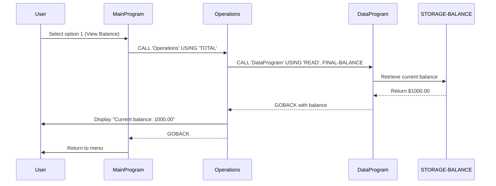
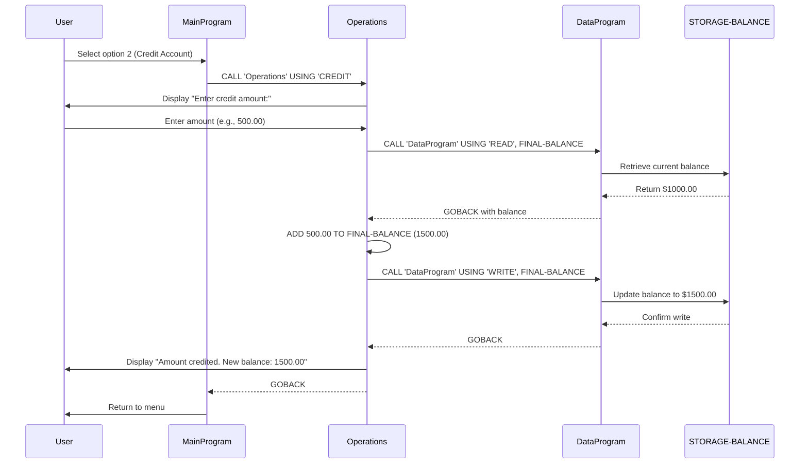
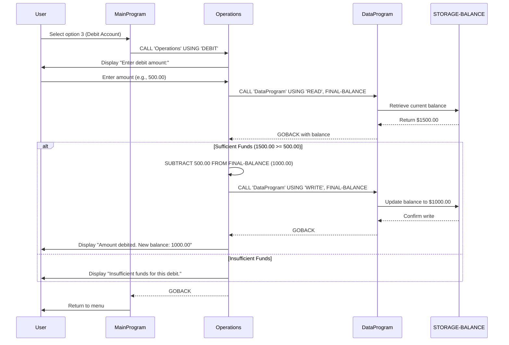

# COBOL Student Account Management System Documentation

## Overview
This documentation covers the COBOL-based Account Management System designed for managing student accounts. The system provides functionality to view account balances, credit accounts, and debit accounts with built-in validation and business rule enforcement.

---

## File Structure

### 1. main.cob
**Purpose:** Entry point and menu interface for the Account Management System

**Key Functions:**
- Displays interactive menu with available operations
- Handles user input for operation selection
- Routes user choices to appropriate operations
- Manages program flow until user exits

**Business Logic:**
- Menu loop continues until user selects "Exit" (option 4)
- Validates user input (options 1-4)
- Displays error message for invalid selections
- Cleanly exits the program upon user request

**Operation Codes:**
- `1` - View Balance (calls Operations with 'TOTAL' code)
- `2` - Credit Account (calls Operations with 'CREDIT' code)
- `3` - Debit Account (calls Operations with 'DEBIT' code)
- `4` - Exit Program

---

### 2. data.cob
**Purpose:** Data persistence layer for account balance storage and retrieval

**Key Functions:**
- Manages persistent account balance storage
- Handles READ operations to retrieve current balance
- Handles WRITE operations to update balance

**Data Structure:**
- `STORAGE-BALANCE`: Persistent storage of account balance (PIC 9(6)V99 format)
  - Supports balances up to $999,999.99
  - Initial value: $1,000.00

**Operation Codes:**
- `'READ'` - Retrieves current balance from storage
- `'WRITE'` - Updates the balance in storage

**Business Rules:**
- Balance precision: 2 decimal places (cents)
- Balance format: 6 digits for dollars + 2 for cents

---

### 3. operations.cob
**Purpose:** Core business operations for account transactions and inquiries

**Key Functions:**

#### View Balance (TOTAL)
- Calls data layer to retrieve current balance
- Displays balance to user
- No balance modification

#### Credit Account (CREDIT)
- Prompts user for credit amount
- Retrieves current balance from data layer
- Adds credit amount to balance
- Updates balance in data layer
- Displays confirmation with new balance

#### Debit Account (DEBIT)
- Prompts user for debit amount
- Retrieves current balance from data layer
- Validates sufficient funds
- If funds available: subtracts amount and updates balance
- If insufficient funds: displays error message and prevents transaction
- Displays confirmation with new balance (if successful)

**Business Rules:**

1. **Initial Balance:** All accounts start with $1,000.00
2. **Credit Operations:**
   - Accepts any positive amount
   - No upper limit validation
   - Balance cannot exceed system maximum (999,999.99)

3. **Debit Operations:**
   - Requires sufficient funds in account
   - Debit amount must be ≤ current balance
   - Transaction is rejected if insufficient funds
   - Balance cannot go negative

4. **Balance Precision:**
   - All amounts stored with 2 decimal places
   - Format: PICTURE 9(6)V99

5. **Data Consistency:**
   - Balance is read from persistent storage before operations
   - Balance is written back after modifications
   - No transactional rollback (single-step updates)

---

## Data Flow Diagram

```
User Input (main.cob)
        ↓
    Menu Selection
        ↓
    Operation Router
        ↓
operations.cob (Business Logic)
        ↓
    data.cob (Data Layer)
        ↓
  Balance Storage
```

---

## Account Balance Format

All account balances use the following COBOL picture clause:
```cobol
PIC 9(6)V99
```

**Format Breakdown:**
- `9(6)` - 6 numeric digits for dollar amount
- `V99` - 2 decimal places for cents (implicit decimal point)

**Valid Balance Range:**
- Minimum: $0.00
- Maximum: $999,999.99

---

## Example Transactions

### View Balance
```
Input:  1 (View Balance)
Output: Current balance: 1000.00
```

### Credit Operation
```
Input:  2 (Credit Account)
        500.00 (amount)
Output: Amount credited. New balance: 1500.00
```

### Debit Operation - Success
```
Input:  3 (Debit Account)
        300.00 (amount)
Output: Amount debited. New balance: 1200.00
```

### Debit Operation - Insufficient Funds
```
Input:  3 (Debit Account)
        2000.00 (amount)
Output: Insufficient funds for this debit.
        (Balance remains 1200.00)
```

---

## Integration Points

### Program Calls
- `MainProgram` → calls `Operations`
- `Operations` → calls `DataProgram`
- `DataProgram` → manages balance storage

### Data Passing
- Programs communicate via USING parameters
- Operation types passed as 6-character strings
- Balance values passed as PICTURE 9(6)V99 numerics

---

## Notes for Modernization

This legacy COBOL system represents a simple account management application with:
- **Strengths:** Simple business logic, clear separation of concerns
- **Areas for Modernization:**
  - No persistent database (in-memory storage only)
  - Single-threaded, no concurrent access handling
  - Limited input validation
  - No audit logging or transaction history
  - No error handling or exception management
  - No security features (authentication, authorization)

---

## Sequence Diagrams

### Complete Application Flow - View Balance



### Complete Application Flow - Credit Account



### Complete Application Flow - Debit Account



---

## Version History
- **v1.0** - Initial COBOL implementation of Account Management System
